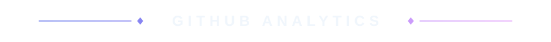

<!-- Header Banner -->
<div align="center">

</div>

<!-- Animated Typing -->
<p align="center">

</p>

<!-- Profile Views & Social Badges -->
<div align="center">


[](https://twitter.com/mustak_kafy)
[](https://github.com/mustakahmedkafy?tab=followers)

</div>

<!-- Divider -->
<p align="center">

</p>

<!-- About Section -->
<br/>
<p align="center">

</p>


**Frontend developer** with a keen eye for design and user experience — I care about how an interface *feels*, not just how it works.

I enjoy turning **complex problems** into clean, intuitive interfaces, and I sweat the small details — spacing, motion, accessibility.

Based in **Bangladesh**, building for the **global web**, always exploring new technologies and design trends.

<br clear="both"/>

<!-- Quick Facts -->
<br/>
<p align="center">

</p>

```javascript
const mustak = {
  pronouns: "he/him",
  location: "Bangladesh",
  focus:    "building scalable web applications",
  funFact:  "debugs with console.log — no shame",
  motto:    "code · coffee · create · repeat",
};
```

<!-- Divider -->
<p align="center">

</p>

<!-- Tech Stack Section -->
<br/>
<p align="center">

</p>

<p align="center">

<br/>

</p>

<br/>

<!-- Divider -->
<p align="center">

</p>

<!-- GitHub Stats Section -->
<br/>
<p align="center">

</p>

<p align="center">

</p>

<p align="center">


</p>

<!-- Divider -->
<p align="center">

</p>

<!-- Connect Section -->
<br/>
<p align="center">

</p>

<div align="center">

[](https://www.mustakkafy.com/)
[](mailto:ahmedmusta99@gmail.com)
[](https://linkedin.com/in/mustakahmedkafy)
[](https://twitter.com/mustak_kafy)
[](https://fb.com/mustakahmedkafy)
[](https://instagram.com/k_a_f_y)
[](https://www.youtube.com/c/thekafyshow)

</div>

<br/>

<!-- Quote -->
<p align="center">

</p>

<!-- Support Section -->
<p align="center"><sub><b>SUPPORT MY WORK</b></sub></p>
<p align="center">
<a href="https://www.buymeacoffee.com/mustakkafy" target="_blank">

</a>
</p>

<!-- Snake Animation -->
<p align="center">
<picture>
<source media="(prefers-color-scheme: dark)" srcset="https://raw.githubusercontent.com/platane/snk/output/github-contribution-grid-snake-dark.svg" />
<source media="(prefers-color-scheme: light)" srcset="https://raw.githubusercontent.com/platane/snk/output/github-contribution-grid-snake.svg" />

</picture>
</p>

<!-- Footer -->
<p align="center">

</p>
